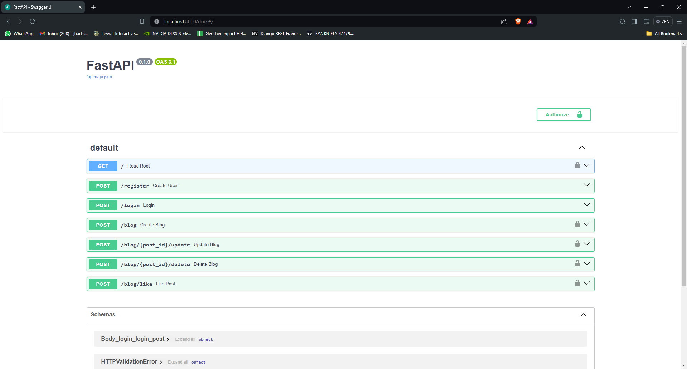

## Environment configuration

Following environment variables need to be set in your OS or added in a new **.env** file from root of this directory.
```
mongodb_pass=add_password
appName=Cluster_Name
SECRET_KEY=Jwt_secret_key
ALGORITHM=HS256
ACCESS_TOKEN_EXPIRE_MINUTES=Access_token
```
* Clone the repository
* Run ```docker-compose build```
* After Running build RUN ```docker-compose up```
* Now navigate to ```http://localhost:8000``` in the browser to test it out.
* Output

